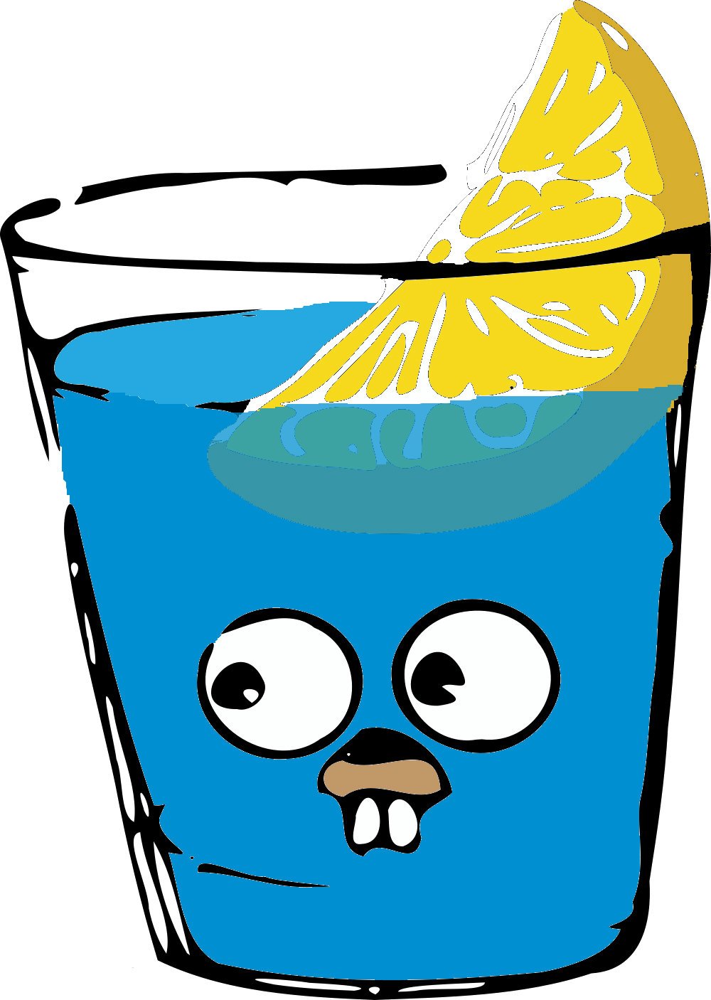

# PostService

#### This is a post service of my backend project written in golang

### Used libraires
- Gin 
- logrus
- GORM

### Used tech:
- Kafka
- Redis
- Postgres
- MinIO
- Docker

### This service is responsible for:
- Searching posts
- Post CRUD
- Comments CRUD
- Category CRUD
